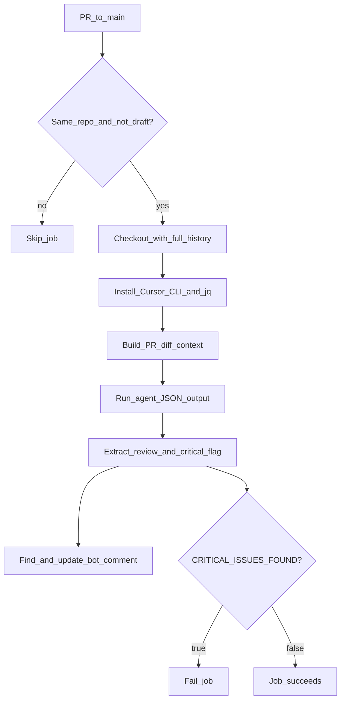

# Cursor CLI PR Code Review in CI

## Goal

Extend [`.github/workflows/ci-cd.yml`](.github/workflows/ci-cd.yml) with a **blocking, PR-only code review job** that:

1. Runs the Cursor CLI agent against the PR diff
2. Posts the agent’s response as a **single updatable PR comment** (not a local `review.txt` artifact)
3. **Fails the workflow** when the agent reports critical issues

Your repo already triggers on `pull_request` to `main`; the new job will be gated further so it only runs in that context.

## Architecture



## Recommended approach: restricted autonomy

Follow Cursor’s [GitHub Actions guidance](https://cursor.com/docs/cli/github-actions): let the agent **analyze only**; let CI **deterministically** post the comment and enforce pass/fail.

- Do **not** use `--force` (that enables file writes; review should be read-only)
- Do **not** ask the agent to write `review.txt` or run `gh pr comment`
- Capture stdout with `--output-format json` and extract `.result` via `jq` ([output format docs](https://cursor.com/docs/cli/reference/output-format))

## Changes

### 1. Add `code-review` job to [`.github/workflows/ci-cd.yml`](.github/workflows/ci-cd.yml)

New job (runs **in parallel** with existing `ci` job for faster feedback):

```yaml
code-review:
  name: Cursor Code Review
  runs-on: ubuntu-latest
  timeout-minutes: 15
  if: >
    github.event_name == 'pull_request' &&
    github.event.pull_request.draft == false &&
    github.event.pull_request.head.repo.full_name == github.repository
  permissions:
    contents: read
    pull-requests: write
```

**Why these guards:**

| Condition | Reason |
|-----------|--------|
| `pull_request` | User requirement: PRs only |
| `branches: main` (already in `on:`) | User requirement: PRs to main |
| `draft == false` | Avoid spending API credits on WIP drafts |
| same-repo check | Fork PRs cannot access `CURSOR_API_KEY`; skip cleanly instead of failing auth |

**Permissions:** `pull-requests: write` is required to create/update PR comments via `GITHUB_TOKEN`.

**Steps (high level):**

1. **Checkout** with full history and PR head SHA:
   ```yaml
   uses: actions/checkout@v4
   with:
     fetch-depth: 0
     ref: ${{ github.event.pull_request.head.sha }}
   ```

2. **Install Cursor CLI** ([official install pattern](https://cursor.com/docs/cli/github-actions)):
   ```yaml
   run: |
     curl https://cursor.com/install -fsS | bash
     echo "$HOME/.cursor/bin" >> $GITHUB_PATH
   ```
   Also install `jq` (`sudo apt-get install -y jq`) for JSON parsing.

3. **Run review script** (see below) with:
   ```yaml
   env:
     CURSOR_API_KEY: ${{ secrets.CURSOR_API_KEY }}
     BASE_SHA: ${{ github.event.pull_request.base.sha }}
     HEAD_SHA: ${{ github.event.pull_request.head.sha }}
     PR_NUMBER: ${{ github.event.pull_request.number }}
   ```

4. **Find existing bot comment** using [`peter-evans/find-comment@v3`](https://github.com/peter-evans/find-comment) with a stable marker:
   - `body-includes: <!-- cursor-code-review -->`
   - `comment-author: github-actions[bot]`

5. **Create or update comment** using [`peter-evans/create-or-update-comment@v4`](https://github.com/peter-evans/create-or-update-comment):
   - `issue-number: ${{ github.event.pull_request.number }}`
   - `body-path: review-body.md` (written by script)
   - `comment-id: ${{ steps.fc.outputs.comment-id }}` when updating

6. **Fail on critical issues** (blocking behavior you chose):
   ```yaml
   - name: Enforce blocking review
     if: steps.review.outputs.critical_issues_found == 'true'
     run: exit 1
   ```

### 2. Add [`.github/scripts/cursor-code-review.sh`](.github/scripts/cursor-code-review.sh)

Centralize review logic in a small bash script:

**Diff context for the agent:**
```bash
git diff "${BASE_SHA}...${HEAD_SHA}" > /tmp/pr.diff
CHANGED_FILES=$(git diff --name-only "${BASE_SHA}...${HEAD_SHA}")
```

**Agent invocation** (adapted from your example + [headless CLI docs](https://cursor.com/docs/cli/headless)):
```bash
agent -p --output-format json "$(cat <<EOF
Review the pull request changes in this repository.

Changed files:
${CHANGED_FILES}

Full diff is available at /tmp/pr.diff — read it with your file tools.

Provide feedback on:
- Code quality and readability
- Potential bugs or issues
- Security considerations
- Best practices compliance

Format your response as GitHub-flavored Markdown suitable for a PR comment.
Be specific: cite file paths and line areas where possible.

At the very end of your response, on its own line, output exactly one of:
CRITICAL_ISSUES_FOUND=true
CRITICAL_ISSUES_FOUND=false

Use true only for issues that should block merging (security vulnerabilities,
data loss bugs, broken auth, etc.). Style/nit issues should use false.
EOF
)" > /tmp/agent-output.json
```

**Parse output:**
```bash
REVIEW=$(jq -r '.result' /tmp/agent-output.json)
CRITICAL=$(echo "$REVIEW" | grep -Eo 'CRITICAL_ISSUES_FOUND=(true|false)' | tail -1 | cut -d= -f2)
# default to true if flag missing (fail-safe for blocking mode)
```

**Write comment file** with marker + metadata header:
```markdown
<!-- cursor-code-review -->
## Cursor Code Review

_Reviewed commit: `<head_sha_short>`_ · _Workflow run: [link](...)_ 

<agent markdown body without the CRITICAL line>
```

**Export to `$GITHUB_OUTPUT`:**
```yaml
critical_issues_found=true|false
```

### 3. Known CI hang mitigation

There is a [known issue](https://forum.cursor.com/t/cursor-agent-hangs-in-github-action-after-executing-command/133511) where `agent -p` occasionally does not exit in GitHub Actions even after producing output. Mitigations to include:

- Job-level `timeout-minutes: 15`
- Wrap the agent call with `timeout 12m` so the step fails fast instead of hanging 6 hours
- Prefer `--output-format json` (single terminal object) over streaming formats

If hangs persist after implementation, a follow-up is to pipe `stream-json` and kill the process once a terminal `result` event appears (community workaround).

## Prompt differences from your example

| Your example | Planned change |
|--------------|----------------|
| `--force` | Removed — review is read-only |
| “write to review.txt” | Removed — CI captures stdout and posts to PR |
| `--output-format text` | `--output-format json` for reliable parsing + blocking flag extraction |
| No PR comment step | Deterministic `find-comment` + `create-or-update-comment` |

## What stays unchanged

- Existing `ci` and `cd` jobs remain as-is
- `CURSOR_API_KEY` secret name matches what you already configured
- Workflow still runs CI on all pushes/PRs; only the new job is PR-to-main scoped

## Verification checklist

After implementation:

1. Open a PR to `main` and confirm a single bot comment appears with the review
2. Push another commit to the same PR and confirm the **same comment is updated** (not duplicated)
3. Test blocking: introduce an obvious security issue in a test branch and confirm `CRITICAL_ISSUES_FOUND=true` fails the job
4. Confirm fork PRs skip the job without auth errors
5. Confirm draft PRs skip the job

## Optional follow-ups (out of scope unless you want them)

- Add `needs: [ci]` so review runs only after lint/test/build pass (saves API usage)
- Add [CLI permission restrictions](https://cursor.com/docs/cli/reference/permissions) via `.cursor/cli.json` to deny writes/shell in CI
- Pin a specific `--model` instead of CLI default
